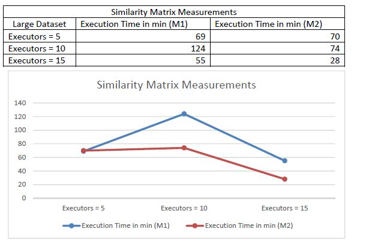

### Pairwise Similarity Measure of Documents
##### Duplicate Detection
Often in real world, entities have two are more representations and they are not identical (Fuzzy duplicates). Perform task to Discover the multiple representation of same real-world object in a large data set.
##### Solution Strategy:
##### 1. Finding 1000 most popular words:
For finding the most popular words, I first found word and number of times it is repeated in all documents and then took top 1000 of the final list with map reduce framework.
while finding the (word, count) pair, first I converted words to lower case characters and removed special character like __~!@\[#\]$%^&*()><:;_+-=\'"/.,__ from the word and replaced it with empty string, with the use of regular expression. And I also removed stop words from the documents by creating my own list of stop words in a list and checking if the word is present in the stop words list and ignored those words. 
After finding all (word, count) pair in all documents, I sorted them in descending order and took top 1000 pairs.
##### Output will be in below format:
`(“word”, count)	(“word”, count) (“word”, count) ….`
##### Observations: 
1.	I tried removing stop words by using nltk library but is raising issues frequently for the large data set. 
2.	While converting word to lower case It throw an error as strings cannot process all the unicode characters, we need to encode them in utf-8 before changing to lower case.
3.	As the takeOrdered() function will return list of words and is not an RDD, So to use saveAsTextFile() function I created another RDD to store this list and saved it in file.
4.	In the final output what I observed is the word ‘nbspnbspnbspnbspnbspnbspnbsp’ repeated highest number of times. This is because after removing the special characters in string &nbsp; and there is no information to ignore the word or not. So I did not filtered the word.
##### 2. Create Inverted index for the 1000 most popular words.
Inverted index will be created for the 1000 most popular words found in step 1.
Inverted index will be of the form

`term1: doc1:weight1_1, doc2:weight2_1, doc3:weight3_1,…
term2: doc1:weight1_2, doc2:weight2_2, doc3:weight3_2,…`
…

where weightx_y is: no. of occurrences of termx in document y /total number of words in document y

1.	To implement this I used wholeTextFiles() function as it will return filename and contents. 
2.	Then I used map function to emit key, value pairs of the form…
((filename, total_words_in_file), words)
3.	Then I used a function to remove special characters as I did same in step 1
4.	Then used map function to emit key value pairs of the for
((filename, word), (total_words_in_file, word_count))
5.	Then filtered the words making the RDD to process only the words that are in 1000 most words list by using RDD.filter() function.
6.	Then reduced based on key then mapped to emit the (key, value) pairs in below format
(word, (filename, word_count/total_words_in_file))
7.	Then performed groupByKey operation on word, and saved the result in a file.
##### Output will in the form:

`(word, ((filename, weight), (filename, weight), …))
(word, ((filename, weight), (filename, weight), …))
…`
##### Observations:
1.	First, I found total words in document by splitting the content of file and adding each content to list then calculating length of list. It caused the program to run slower, then I simply used __len(contents.split())__ function to count the words in file, since counting the number of words in list doesn’t depend on removing stop words. As it is not mentioned in the problem description, I counted stop words also.
2.	This program taking so long to run, The reason behind this which I feel is groupByKey() will take lot of time than reduceByKey() function since it takes more operation on each key.
3.	I have used eval() function to read tuples in string while reading as sc.textFile() will return strings, which otherwise would have been complicated.
##### 3. Calculate Similarity Matrix:
Similarity matrix is of the form S(docx, docy) = 𝑡ϵ𝑉(𝑤𝑒𝑖𝑔ℎ𝑡𝑡_𝑑𝑜𝑐𝑥×𝑤𝑒𝑖𝑔ℎ𝑡𝑡_𝑑𝑜𝑐𝑦)
With V being the vocabulary (determined in part 1) and the weights having been determined in part 2.
1.	To implement similarity matrix taking output of inverted index as an input, I have calculated multiplied weights of pairs of documents in a loop which will take N(N-1)/2 calculations.
2.	After calculating the pairwise similarities, used map function to emit ((doc1, doc2), weight) as key-value pairs.
3.	After that reduced by key and added the weights to get the similarity matrix.
##### Output will be of the form:

`((doc1, doc2), similarity) 
((doc1, doc3), similarity) ….`
##### Observations:
1.	While calculating similarities, pairs like ((doc1, doc2), weights) and ((doc2, doc1), weights) will produce different results thinking that two are different keys. In order to overcome the bug I used sorted() to treat both the keys same.
##### 4. Ten Most similar or identical pairs of documents:
1.	To implement this, I have taken output of similarity matrix as an input and then sorted the pairs based on the value. 
2.	After that taken the top 10 results by RDD.take(10) function and saved it into a file.
##### Observations:
1.	Keeping many partitions for this output will be waste of time, it takes time to create unnecessary partition if it is mentioned. For the result of 10 rows one partition is enough. 
##### Steps to Run the code:
Input path and output path are to be provided in arguments as shown below.
Follow the sequence to run the codes.
##### 1.	Most Popular Words:

```spark-submit --master yarn --deploy-mode cluster --conf spark.ui.port=4070 --num-executors 15 --executor-cores 3  --executor-memory 10G pyspark_most_popular.py /cosc6339_hw2/large-dataset/* /bigd43/1000_most_exe_15```
##### 2.	Inverted Index:

```spark-submit --master yarn --deploy-mode cluster --conf spark.ui.port=4070 --num-executors 15 --executor-cores 3  --executor-memory 10G pyspark_inverted_index.py /bigd43/1000_most_exe_15/* /cosc6339_hw2/large-dataset/* /bigd43/inverted_index_exe_15```
##### 3.	Similarity Matrix:

```spark-submit --master yarn --deploy-mode cluster --conf spark.ui.port=4070 --num-executors 15 --executor-cores 3  --executor-memory 10G pyspark_similarity_matrix.py /bigd43/inverted_index_exe_15/* /bigd43/similarity_matrix_exe_15```
##### 4.	Top 10 Similar Documents:

```spark-submit --master yarn --deploy-mode cluster --conf spark.ui.port=4070 --num-executors 5 --executor-cores 3  --executor-memory 10G pyspark_top_10.py /bigd43/similarity_matrix_exe_15/* /bigd43/top_10_exe_15```
##### Resources Used:
1.	Hadoop version 3.0.3
2.	Python version 2.7.13
3.	Pyspark version 2.3.1
4.	Whale Cluster
a.	50 Appro 1522H nodes (whale-001 to whale-057), each node with
i.	two 2.2 GHz quad-core AMD Opteron processor (8 cores total)
ii.	16 GB main memory
iii.	Gigabit Ehternet
iv.	4xDDR InfiniBand HCAs (not used at the moment)
b.	Network Interconnect
i.	144 port 4xInfiniBand DDR Voltaire Grid Director ISR 2012 switch (donation from TOTAL)
ii.	two 48 port HP GE switch
c.	Storage
i.	4 TB NFS /home file system (shared with crill)
ii.	~7 TB HDFS file system (using triple replication)
##### Results:
I have run the code for large data set on executors 5, 10, and 15 with 3 cores per executor and 10GB executor memory. I have taken two measurements for the inverted index and similarity matrix tasks.Below are the execution times for the tasks on large data set.





 
##### Findings:
From the measurements what I observed is that if we increase the number of executors and executor cores, the time it will take for the task to execute will decrease. I wouldn’t completely accept that these parameters will definitely improve the performance, but there will be other parameters that will affect the performance like availability of resources and load on the cluster. For instance, while running the Inverted index task (measurement 1) even the number of executors increased, the execution time did not decrease. I believe that the reason was, at that time the load on the cluster was high since number of job submission were heavier than the cluster could normally handle. Also, it will depend on the cluster memory that was reserved for a job submission. If a job summitted beyond the reserved memory, other jobs will be affected.
